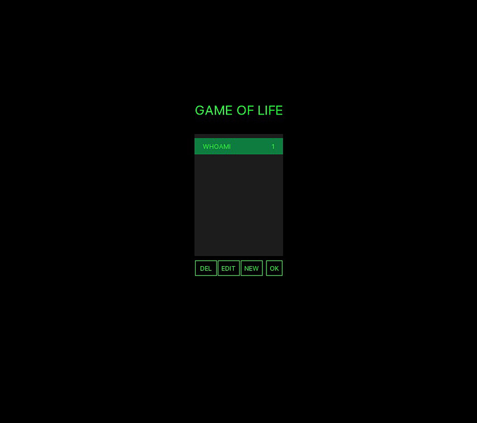
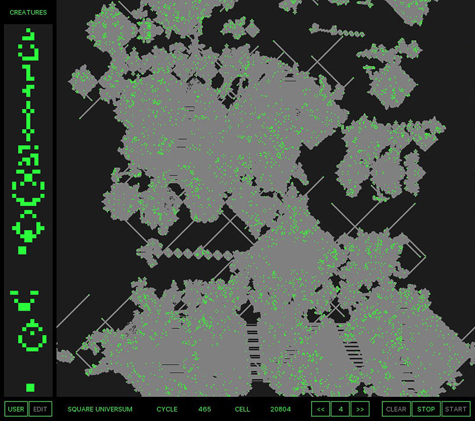
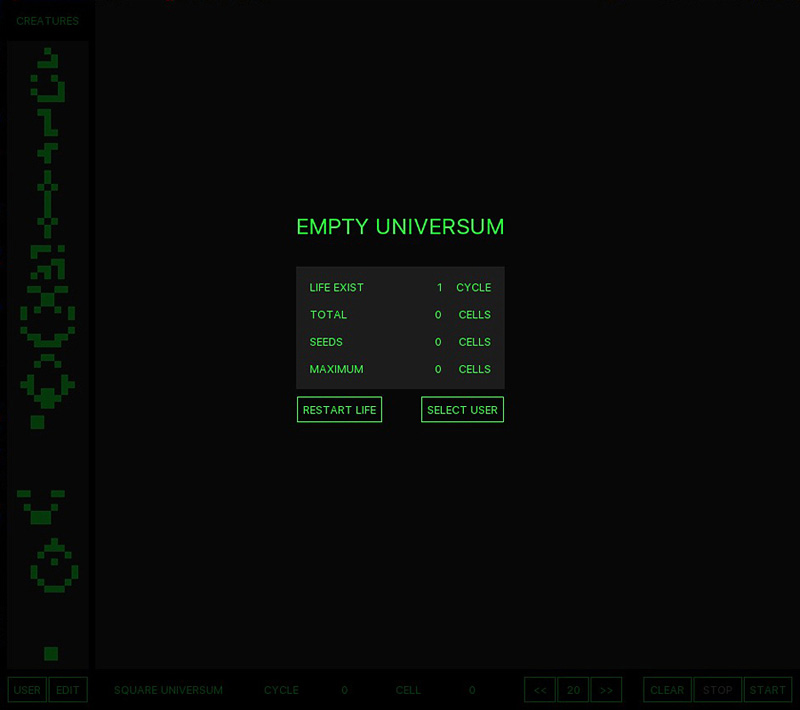

# LifeConway-Python3

Conway's Game of Life

1.0 (2016 - 3 days to build, but I am only start to code)

3.0 (2017 - use bool flag to stop, many comments with old code)

3.5 (2017 – always erase, after_cancel, improve speed, pep-8)

4.0 (2017 – 4 px. slow fill pixels, 200 cells)

4.5 (2017 – 1 px. improve painting and syntax, 600 cells)

5.0 (2017 – 1 px. virtual matrix, del self.cell=int, 900 cells)

5.1 (2017 – 1 px. virtual matrix, total update very slow)

5.2 (2017 - 1 px. thread pool executor, same perfomans)

6.0 (2017 - 1 px. use pygame, made simple GUI by pygame, 9000 cells 4 fps)

7.0 (2017 - 1 px. no img, add editor, dark theme, class glider, users data)

8.0 (2017 - 1 px. cython 26000 cells 4 fps)

9.0beta (2017 - 1 px. numpy 22000 cells 4 fps)

